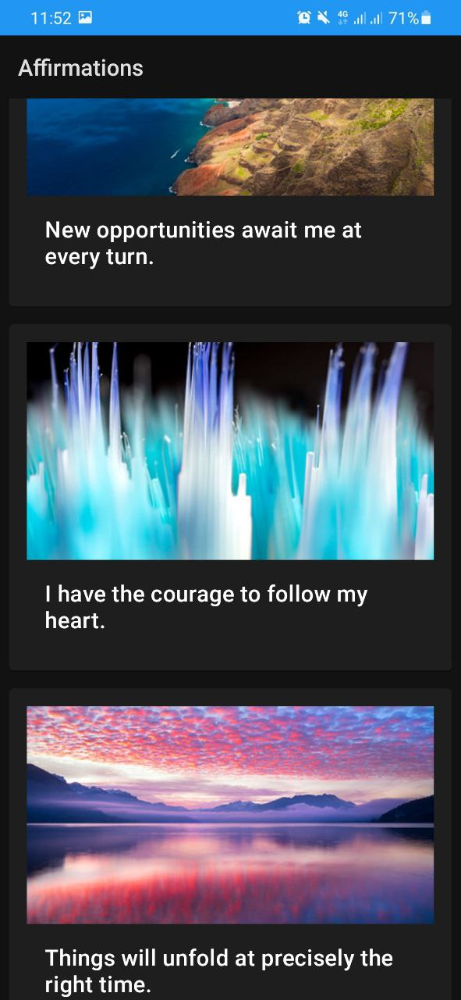

### Affirmation App

The app implements the list of affirmations, each of which is represented with its own image.

Its realization aims to study and experience such things as:

- Using RecyclerView to display a list of data
- Organizing code into packages
- Adding images to display via RecyclerView
- Using MaterialCardView in a RecyclerView item layout

#### Visual results

 

