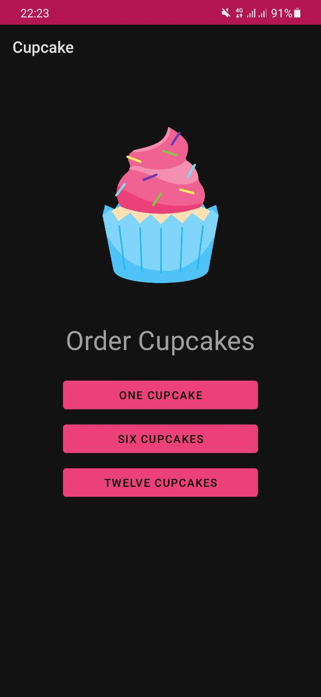
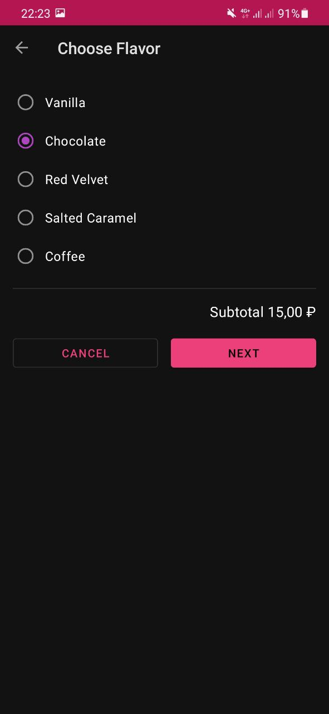
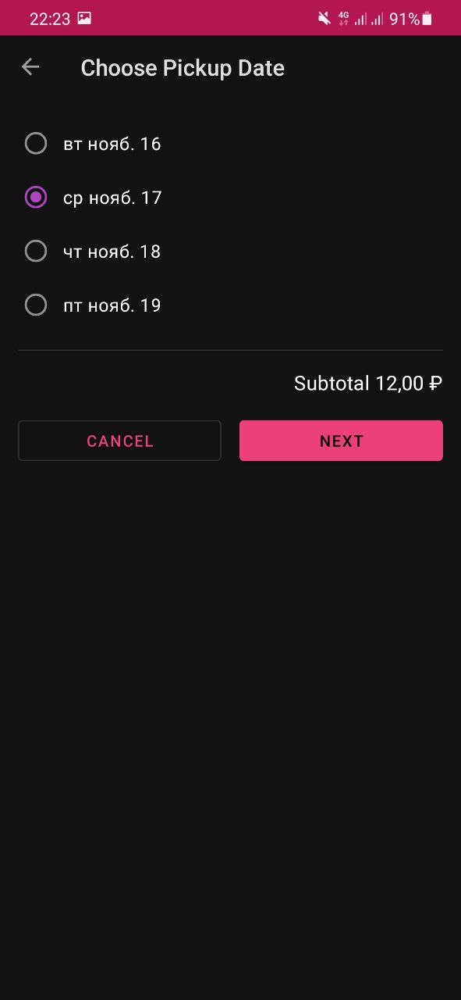
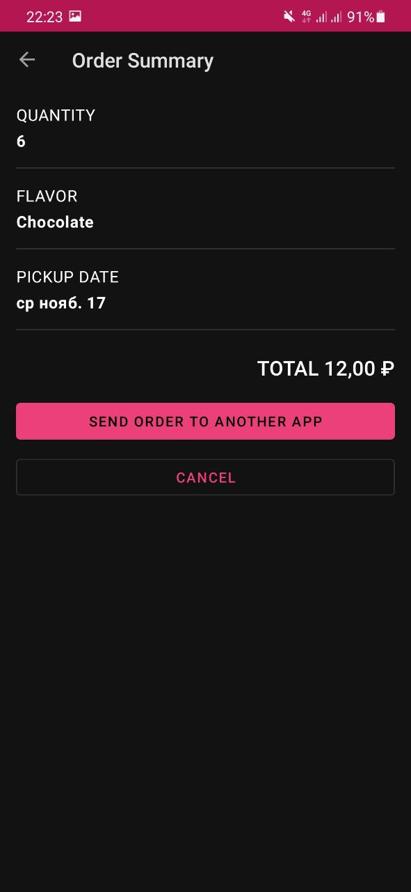
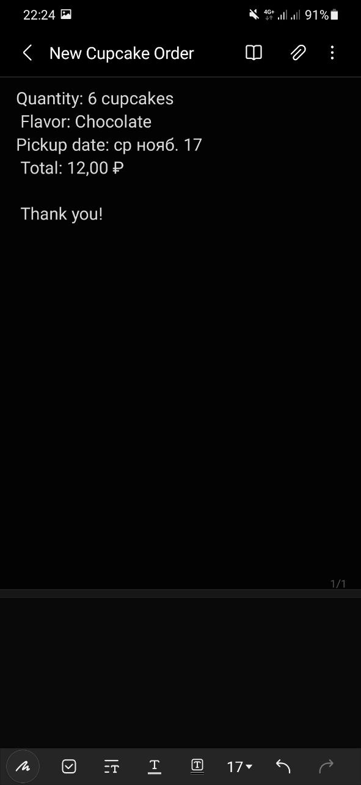

### Cupcake App

The app, which displays an order flow for cupcakes, allowing the user to choose the cupcake flavor, quantity and pickle date, and after to send the order to another app in form of the note.

Its realization aims to study and experience such things as:

- Using a shared ViewModel across fragments in an activity
- Applying a LiveData transformation
- Implementing back stack behavior

#### Visual results

 &nbsp; 

 

