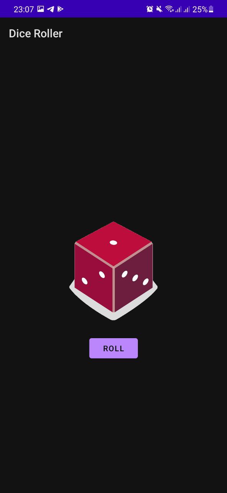
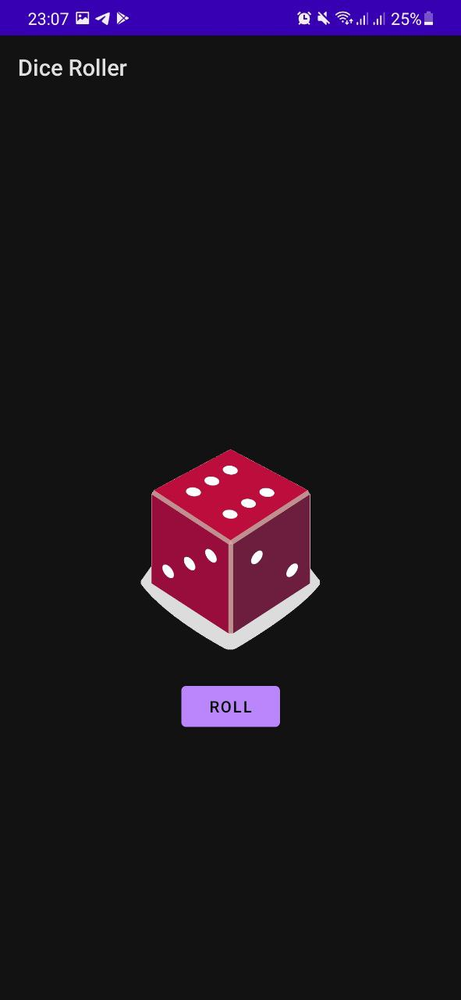

### Dice Roller App

The app, where users click a button to just roll a dice.

Its realization aims to study and experience such things as:

- Adding Buttons to an app
- Adding behavior for Button
- Editing Activity code
- Displaying Toast messages
- Updating content of TextView while an app is running
- Updating UI of an app based on user input

#### Visual results

 &nbsp; 

