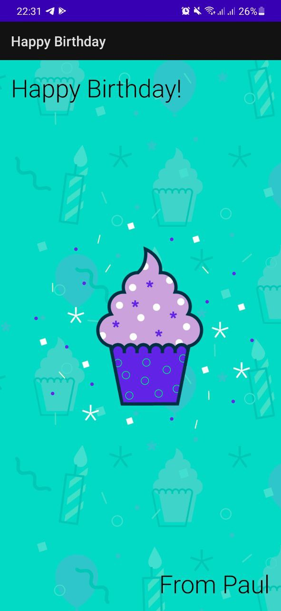

### Birthday Card App

This is first Android app, that was implemented via Google Android lessons.

Its realization aims to study and experience such things as:

- Views and ViewGroups of UI
- Displaying text in TextView
- Setting attributes of TextView
- Adding images to an app
- Displaying images via ImageView
- Extracting text into a string resource

##### Visual results

