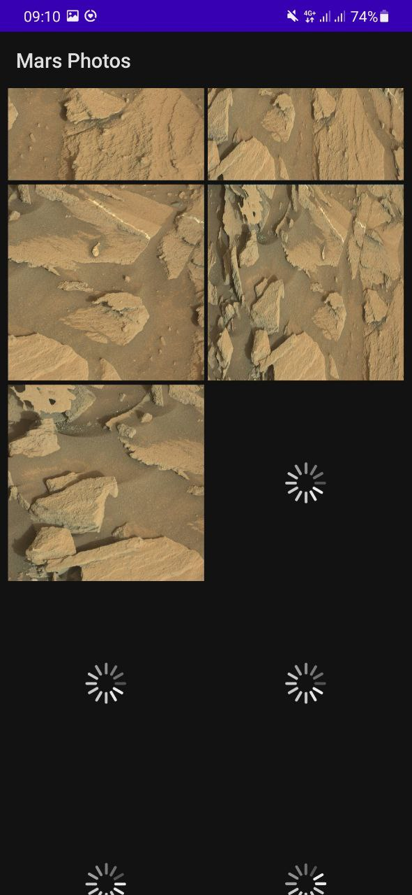
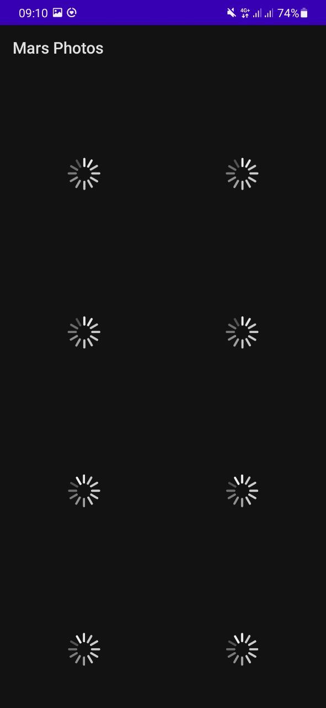
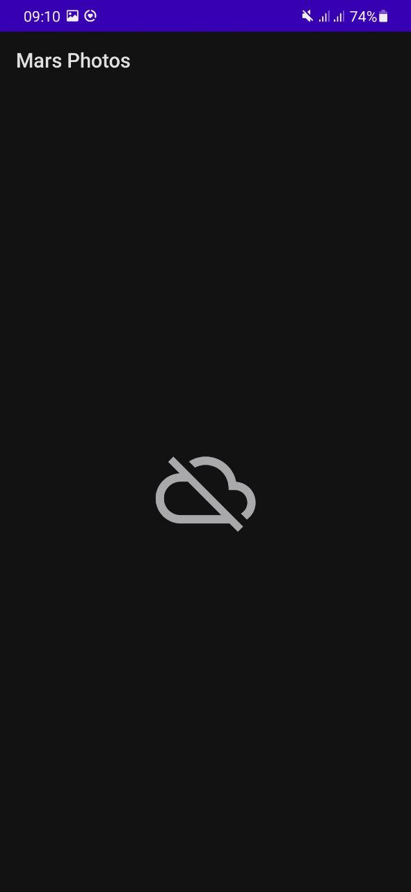
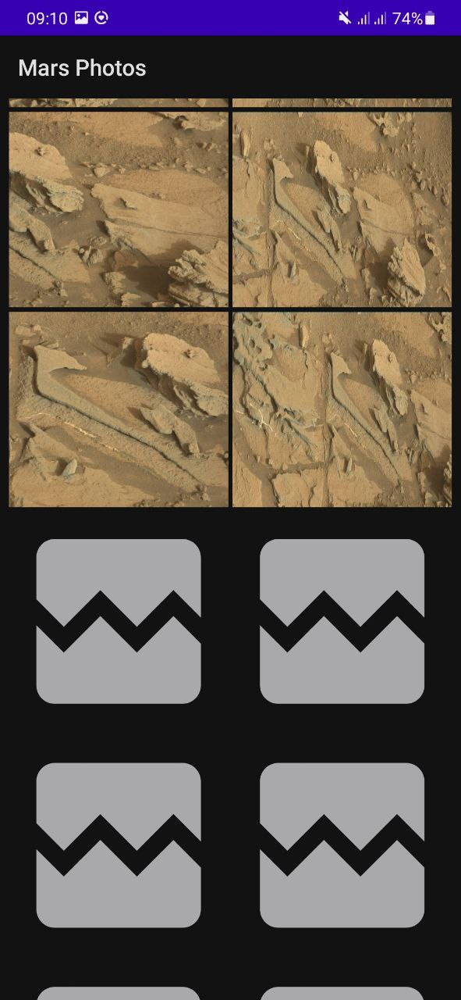

### Mars Photo App

The app, which downloads photos of Mars from server and displays them on the screen.

Features: 

- real time effective downloading images from server
- downloading only images that can be captured by display of the device
- displaying "broken image" icon in case download is failed (connection error)
- displaying "no connection" icon in case there is no internet connection at the moment of starting the app

Its realization aims to study and experience such things as:

- Introducing in REST web service
- Using Retrofit to connect to a REST web service and get a response
- Using the Moshi to parse the JSON response into a data object
- Using the Coil to load and display an image from a web URL
- Handling potential errors as the image download and display

#### Visual results

 &nbsp; 

 
