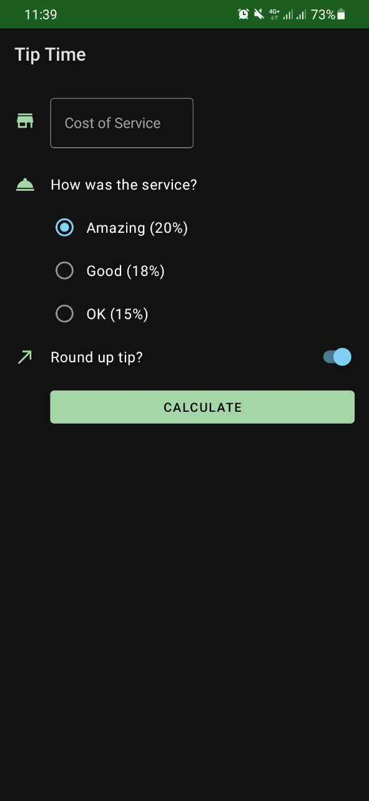
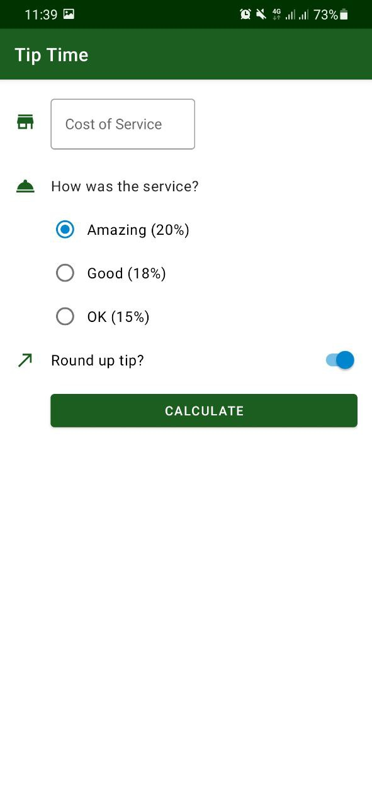
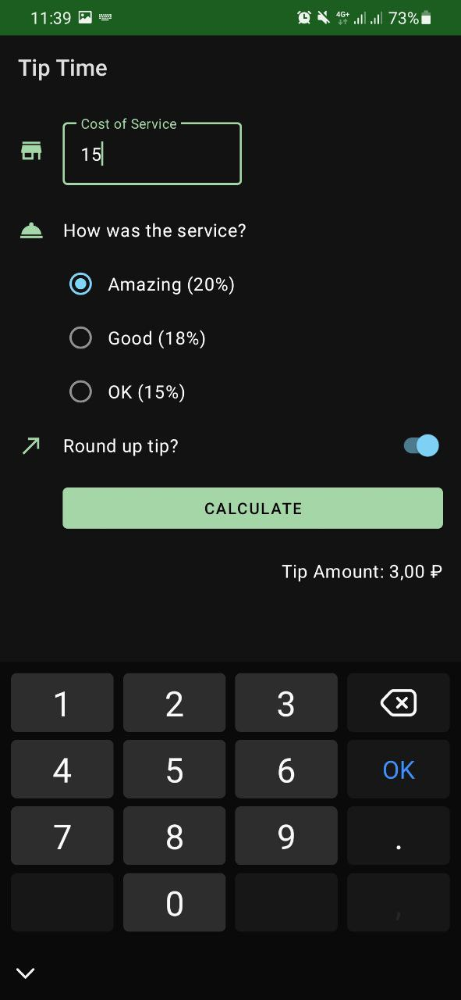
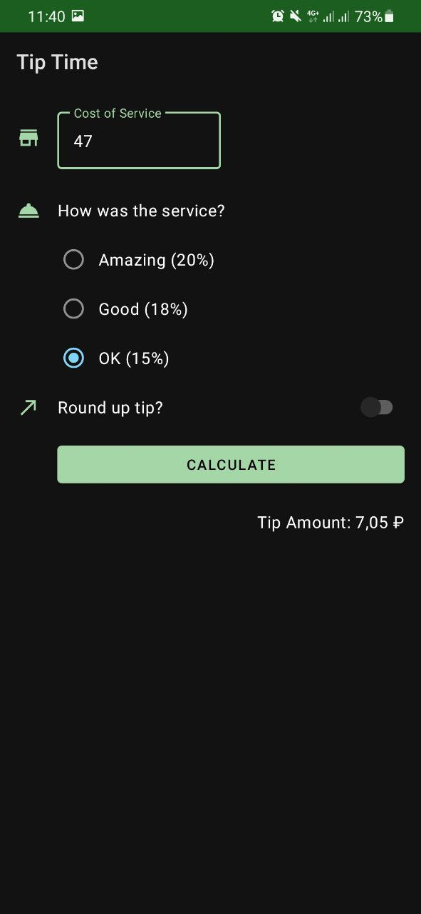

### Tip Calculator App

The app, which implements the logic of calculating tips with 3 types of percentage.

Its realization aims to study and experience such things as:

- Writing XML layouts for an app
- Selecting effective colors for an app according Material Design principles
- Applying a style to a view
- Changing an app look using themes
- Changing launcher icon of an app (adaptive icons)
- Using Material Design Components

#### Visual results

 &nbsp; 

 
