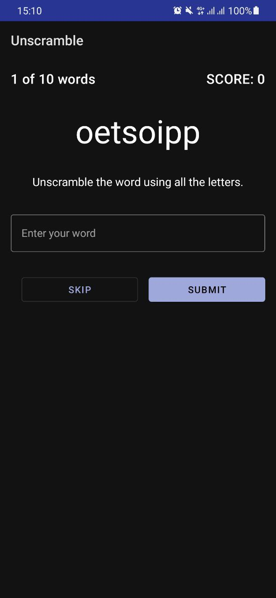
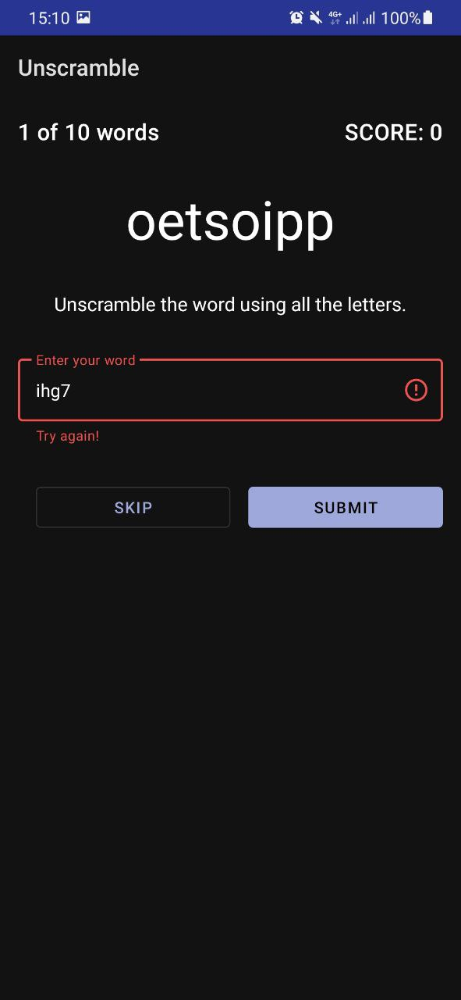
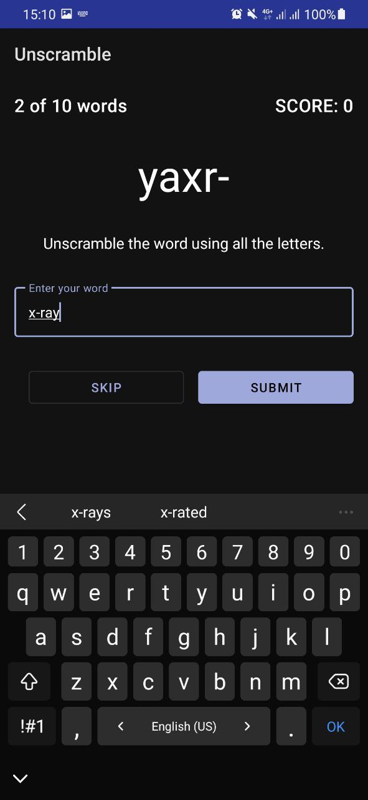
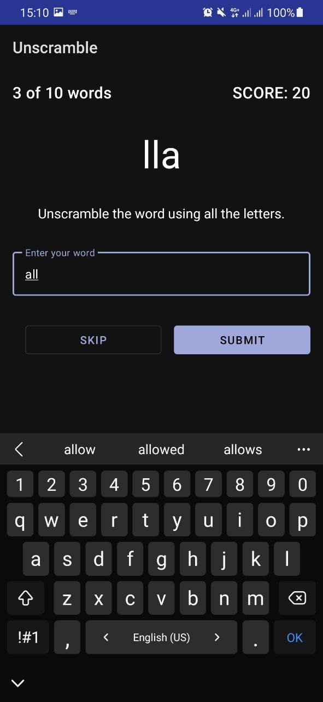
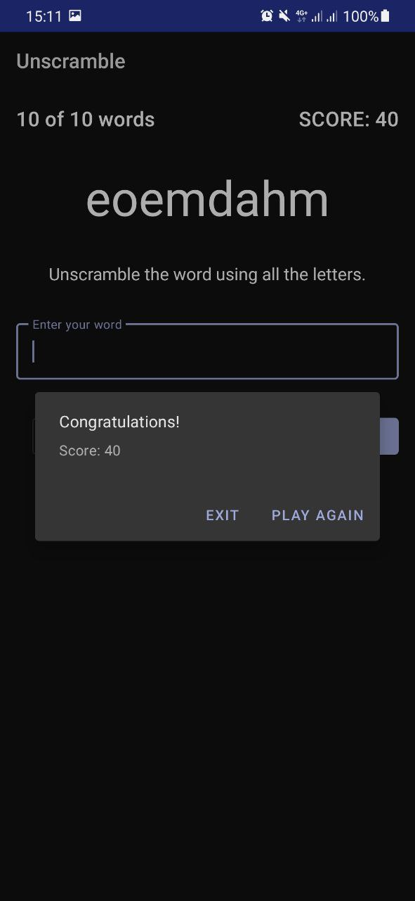

### Unscramble App

The app, which represents the game where an user should guess the scrambled words.

Features: 

- opportunity to guess the word with no attempt limits or pass it 
- getting scores for guessed words
- getting an alert if there is input errors
- opportunity to start new game or leave the app after ending the current 'scramble' session
- avoiding word repetitions 

Its realization aims to study and experience such things as:

- Basics of Android app architecture
- Using ViewModels in an app 
- Retaining data through device-configuration changes via ViewModel
- Using backing properties
- Using MaterialAlertDialog
- Using LiveData to update views in real time

#### Visual results

 &nbsp; 

 

