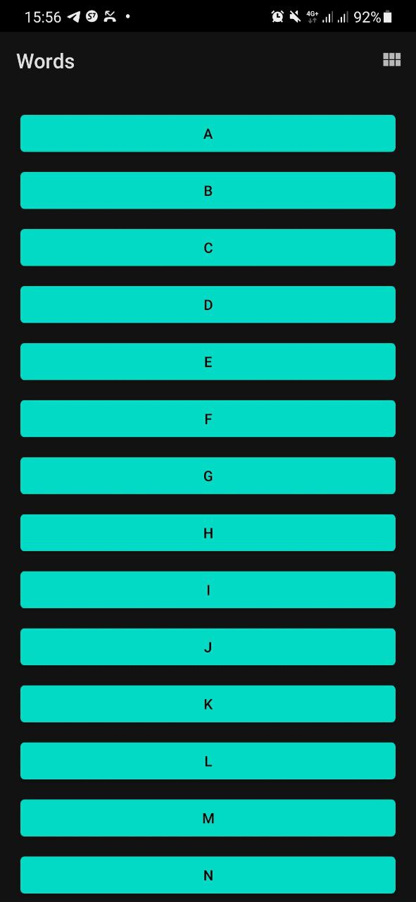
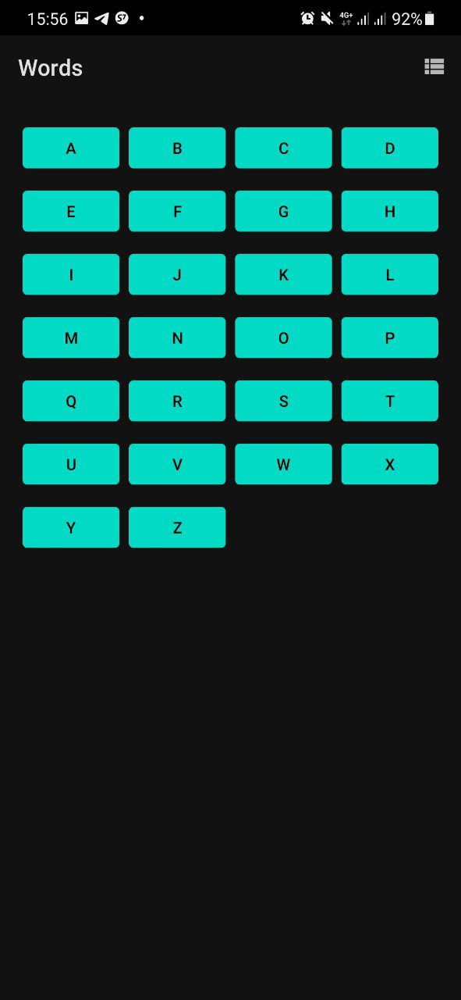
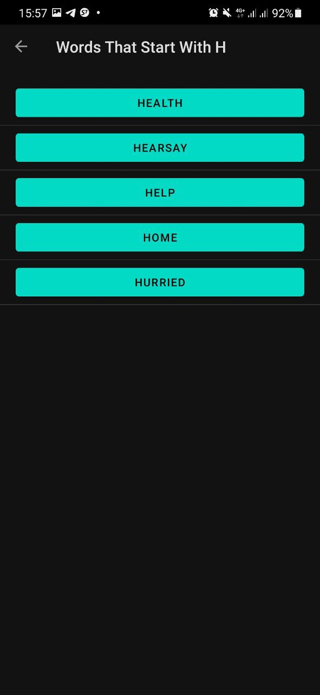
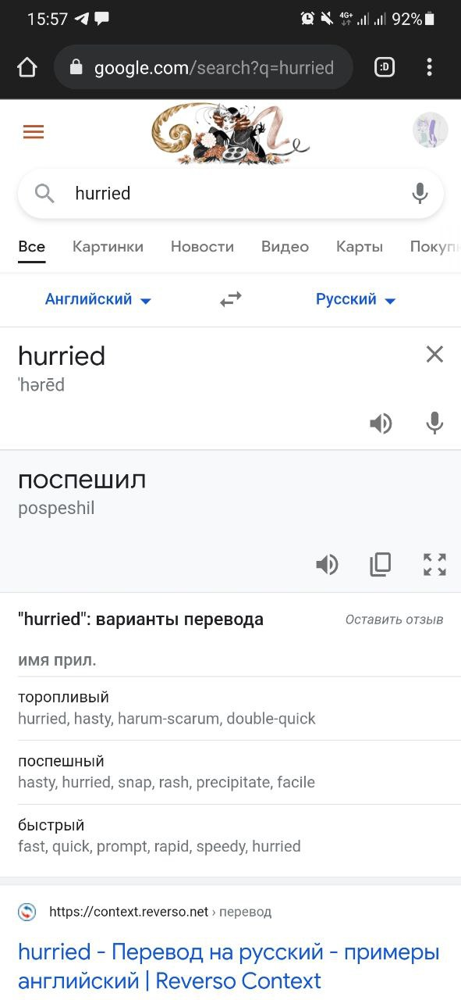

### Words App

The app, which implements two screens: one with letters and one with the words corresponding to the letter, which connected and send data to each other and also send query to Internet.

Features: 

- switching between linear and grid layout of RecyclerView 
- getting random set of words with predefined start letter each time letter is chosen
- getting the definition (and the translation) of chosen word in Internet

- opportunity to choose an suitable web browser to send query 

Its realization aims to study and experience such things as:

- Lifecycles of activities and fragments
- Navigating between activities in an app
- Converting an existing activity into a fragment
- Using Jetpack Navigation Component
- Adding destinations to a navigation graph
- Passing data between fragments while using the Safe Args plugin

#### Visual results

 &nbsp; 

 
